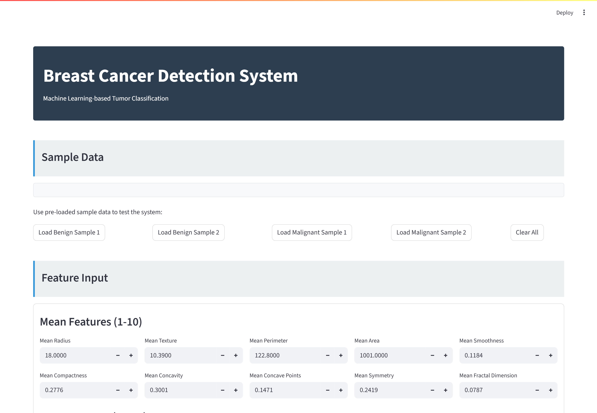

---

# 🎯 Breast Cancer Prediction using SVM  
**By Arun Pandey Laudari**

A machine learning model to classify breast tumors as **Benign** or **Malignant** using Support Vector Machines (SVM) and the Wisconsin Breast Cancer dataset.

---

## 📌 Overview

This project uses **Support Vector Machine (SVM)** to predict tumor type based on 30 diagnostic features. The model is trained on the scikit-learn built-in breast cancer dataset and achieves high accuracy in distinguishing between malignant and benign tumors.

---

## 🛠️ Tech Stack
- Python, scikit-learn
- pandas, numpy
- matplotlib, seaborn
- StandardScaler & SVM
- joblib (model persistence)

---

## 📊 Key Features
- Data preprocessing and scaling
- EDA with correlation heatmap and class distribution
- Comparison of SVM with **Linear**, **RBF**, and **Polynomial** kernels
- Model evaluation using confusion matrix and classification report
- Exported model for future use

---

## 📈 Results

| Model       | Accuracy |
|------------|----------|
| Linear SVM | 97.37%   |
| **RBF SVM** | **98.25%** ✅ |
| Poly SVM   | 95.61%   |

✅ **Best Model**: **SVM with RBF Kernel**

---

## 🖼️ Screenshots


## 💾 Usage

### Install dependencies:
```bash
pip install numpy pandas scikit-learn matplotlib seaborn joblib
```

### Run:
```bash
python breast_cancer_svm.py
```

### Predict on new data:
```python
import joblib
import numpy as np

model = joblib.load('svm_model.joblib')
scaler = joblib.load('scaler.joblib')

new_data = np.array([[17.99, 10.38, ..., 0.08996]])  # 30 features
scaled = scaler.transform(new_data)
prediction = model.predict(scaled)

print("Result:", "Benign" if prediction[0] == 1 else "Malignant")
```

---

## 📦 Saved Artifacts
- `svm_model.joblib` – Trained RBF SVM model
- `scaler.joblib` – Fitted StandardScaler

---


## 📄 License
MIT License – See [LICENSE](LICENSE) for details.

---

